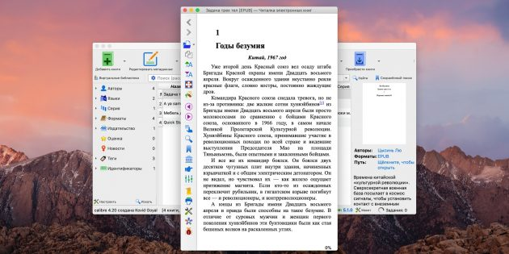
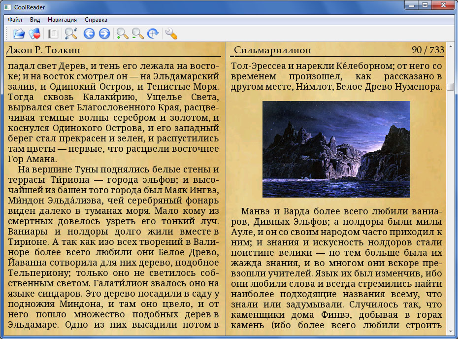
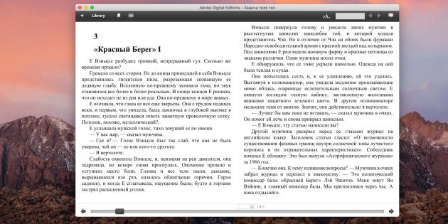
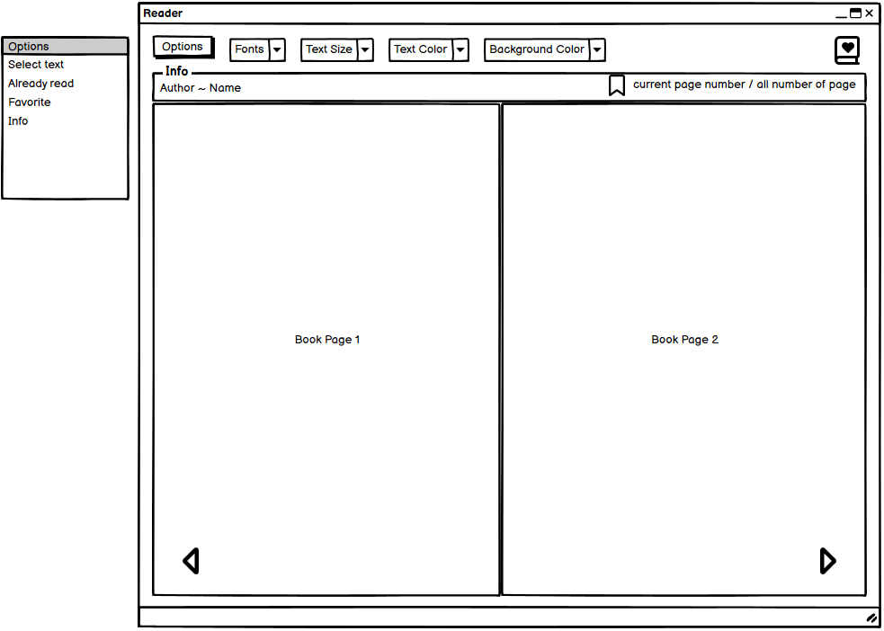

# Требования к проекту
---

# Содержание
1. [Введение](#intro)  
1.1 [Назначение](#appointment)  
1.2 [Бизнес-требования](#business_requirements)  
1.2.1 [Исходные данные](#initial_data)  
1.2.2 [Возможности бизнеса](#business_opportunities)  
1.2.3 [Границы проекта](#project_boundary)  
1.3 [Аналоги](#analogues)  
1.3.1 [Calibre](#calibre)  
1.3.2 [Cool Reader](#cool_reader)  
1.3.3 [Adobe Digital Editions](#adobe_digital_editions)  
1.4 [Сравнение приложений](#comparison_of_applications)
2. [Требования пользователя](#user_requirements)  
2.1 [Программные интерфейсы](#software_interfaces)  
2.2 [Интерфейс пользователя](#user_interface)  
2.3 [Характеристики пользователей](#user_specifications)  
2.3.1 [Аудитория приложения](#application_audience)  
2.3.1.1 [Целевая аудитория](#target_audience)  
2.3.1.2 [Побочная аудитория](#collateral_audience)  
2.4 [Предположения и зависимости](#assumptions_and_dependencies)  
3. [Системные требования](#system_requirements)  
3.1 [Функциональные требования](#functional_requirements)  
3.1.1 [Основные функции](#main_functions)  
3.1.1.1 [Выбор доступных функций](#options)  
3.1.1.2 [Чтение файла](#reading_file)  
3.1.1.3 [Прочие параметры](#other_functions)   
3.1.2 [Ограничения и исключения](#restrictions_and_exclusions)  
3.2 [Нефункциональные требования](#non-functional_requirements)  
3.2.1 [Атрибуты качества](#quality_attributes)  
3.2.1.1 [Требования к удобству использования](#requirements_for_ease_of_use)  
3.2.2 [Внешние интерфейсы](#external_interfaces)  
3.2.3 [Ограничения](#restrictions)  

<a name="intro"/>

# 1 Введение

<a name="appointment"/>

## 1.1 Назначение
Десктопное приложение "Reader" предназначено для чтения и собрания персональной электронной библиотеки, которая уместится на ПК. Приложение создано для пользователей ОС Windows 10.

<a name="business_requirements"/>

## 1.2 Бизнес-требования

<a name="initial_data"/>

### 1.2.1 Исходные данные
Приложение предоставляет возможность пользователю собрать свою коллекцию книг на все случаи жизни. 

<a name="business_opportunities"/>

### 1.2.2 Возможности бизнеса
Reader будет пользоваться популярностью у современного человека, так как литература является неотъемлемой частью досуга современного человека.

<a name="project_boundary"/>

### 1.2.3 Границы проекта
Приложение позволит читать книги разных форматов, оценивать книги, выделять цитаты, объединять книги в папки по тематике.

<a name="analogues"/>

## 1.3 Аналоги

<a name="calibre"/>

### 1.3.1 Calibre

**Русский интерфейс:** есть  
**Цена:** бесплатный  
**Ссылка на сайт производителя:** https://calibre-ebook.com

Окно Calibre.  
  

Calibre поможет удобно организовать и хранить всю вашу цифровую литературу, позволит править метаданные, а также конвертировать файлы в любые форматы, синхронизировать с ридерами и, конечно, читать.

<a name="cool_reader"/>

### 1.3.2 Cool Reader
**Русский интерфейс:** есть  
**Цена:** бесплатный 
**Ссылка на сайт производителя:** https://cool-reader.ru

Окно Cool Reader.  
  

Популярная кросс‑платформенная читалка с открытым исходным кодом, которая привлекает обширным набором функций и множеством тонких настроек. Cool Reader умеет загружать книги из OPDS‑каталогов, позволяет до мелочей корректировать отображение шрифтов и вёрстку, включая фон и CSS‑стили.

<a name="adobe_digital_editions"/>

### 1.3.3 Adobe Digital Editions
**Русский интерфейс:** есть  
**Цена:** бесплатный
**Ссылка на сайт производителя:** https://www.adobe.com/uk/solutions/ebook/digital-editions.html

Окно Adobe Digital Editions.  
  

Простая читалка от Abobe с базовым набором функций для просмотра ePub и PDF на любых устройствах. Добавленные книги отображаются в виде удобного для навигации списка или в виде наглядных обложек.

<a name="comparison_of_applications"/>

## 1.4 Сравнение приложений

| Функция |  Calibre | Cool Reader | Adobe Digital Editions |
|:---|:---:|:---:|:---:|
| Поддержка русского языка | + | + | + |
| Бесплатное использование | + | + | + |
| ePub | + | + | + |
| fb*2 | + | + | - |
| PDF | + | + | + |
| DOC | + | + | - |
| HTML/XHTML | + | + | + |
| RTF | + | + | - |

<a name="user_requirements"/>

# 2 Требования пользователя

<a name="software_interfaces"/>

## 2.1 Программные интерфейсы
В основе приложения - фреймворк QT.

<a name="user_interface"/>

## 2.2 Интерфейс пользователя
Главное окно приложения.  

<a name="user_specifications"/>

## 2.3 Характеристики пользователей

<a name="application_audience"/>

### 2.3.1 Аудитория приложения

<a name="target_audience"/>

#### 2.3.1.1 Целевая аудитория
Люди средней возрастной категории со средним или выше среднего уровнем образования, обладающие минимальной грамотностью.

<a name="collateral_audience"/>

#### 2.3.1.2 Побочная аудитория
Люди младшей и старшей возрастных категорий, обладающие минимальной грамотностью.

<a name="assumptions_and_dependencies"/>

## 2.4 Предположения и зависимости
Приложение работает некорректно при некорректных форматах файлов.

<a name="system_requirements"/>

# 3 Системные требования

<a name="functional_requirements"/>

## 3.1 Функциональные требования

<a name="main_functions"/>

### 3.1.1 Основные функции

<a name="options"/>

#### 3.1.1.1 Выбор доступных функций
**Описание.** После нажатия на кнопку "Options" появляется окно с доступными функциями.

| Функция | Требования | 
|:---|:---|
| Select text | Приложение должно открыть окно проводника для выбора файла для прочтения |
| Already read | Приложение должно предоставить пользователю список уже прочитанных документов |
| Favorite | Приложение должно предоставить пользователю список понравившихся документов |
| Info | Пользователю должна предоставиться общая информация о пользовании приложением |

<a name="reading_file"/>

#### 3.1.1.2 Чтение файла
**Описание.** Выбранный файл делится на страницы и отображается пользователю в книжном формате. Сверху отображается основная информация о файле: имя автора и название "книги"(если к таковым имеется доступ) и текущий номер страницы. Около номера страницы находится значок создания закладки для более комфортного поиска страницы. 
 
| Функция | Требования | 
|:---|:---|
| Пролистать назад | Кнопка в левом нижнем углу должна выполнить функцию пролистывания назад |
| Пролистать вперед | Кнопка в правом нижнем углу должна выполнить функцию пролистывания вперед |
| Добавить закладку | В файл с закладками должен добавиться номер текущей страницы |

<a name="other_functions"/>

#### 3.1.1.3 Прочие параметры
**Описание.** В верхней части главного окна располагается ряд дополнительных функций.

| Функция | Требования | 
|:---|:---|
| Fonts | Приложение должно изменить шрифт отображаемого текста на выбранный в выпадающем списке |
| Text Size | Приложение должно изменить размер отображаемого текста на выбранный в выпадающем списке |
| Text Color | Приложение должно изменить цвет отображаемого текста на выбранный в выпадающем списке |
| Background Color | Приложение должно изменить цвет фона отображаемого файла на выбранный в выпадающем списке |
| Add to Favorite | Приложение должно поместить копию файла в папку Favorite |

<a name="restrictions_and_exclusions"/>

### 3.1.2 Ограничения и исключения
**Описание.** Приложение работает корректно при условии, что используемый файл имеет корректный формат;
 

<a name="non-functional_requirements"/>

## 3.2 Нефункциональные требования

<a name="quality_attributes"/>

### 3.2.1 Атрибуты качества

<a name="requirements_for_ease_of_use"/>

#### 3.2.1.1 Требования к удобству использования
1. Доступ к основным функциям приложения не более чем за две операции;
2. Все функциональные элементы пользовательского интерфейса имеют названия, описывающие действие, которое произойдет при выборе элемента;
3. Пошаговая инструкция использования основных функций приложения отображена в справке.

<a name="external_interfaces"/>

### 3.2.2 Внешние интерфейсы
Окна приложения удобны для использования пользователями с плохим зрением:
  * размер шрифта текста настраиваемый;
  * функциональные элементы контрастны фону окна.

<a name="restrictions"/>

### 3.2.3 Ограничения
1. Приложение реализовано на платформе QT Framework 6.5.2;
2. Все создаваемые в приложении копии файлов хранятся в исходной папке проекта.